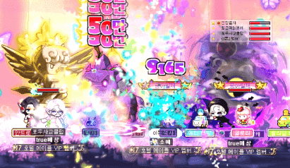
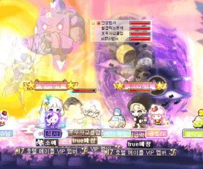
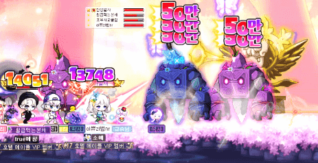
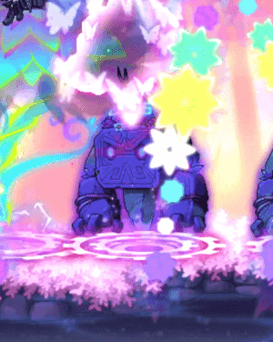
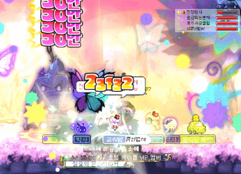
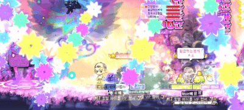
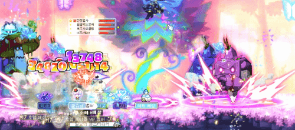
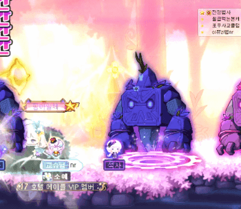
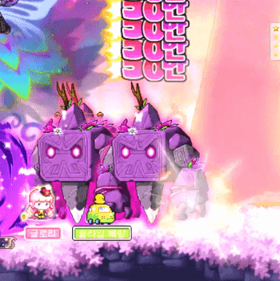
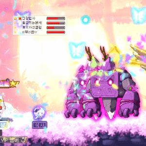

## 노말 루시드 사망 패턴

### 골렘

> 위에서 찍혀서

> 위에서 찍혀서 (2)

> 위에서 찍혀서 (3)

> 점프로 넘어오다가

> 찍히고 밀격 -> 찍힘

> 밀격 -> 찍힘 (2)

> 찍혀서 (이건 엔레대신 힐쓰고 있었으면 살았을것)

> 둘다 찍히고 밀격 , 찍히고 밀격

### 텔레포트

> 비숍혼자 다른곳으로 텔포되고 나머지사람들은 골렘 위로 텔포

> 골렘 위로 텔포 (2)

> 골렘 위로 텔포 (3)

### 칼날

> 왜 유독 죽었지? 데미지가 더 들어가는건가?

### ?

> 어떻게살았지 왜 골렘한테 1맞았지

